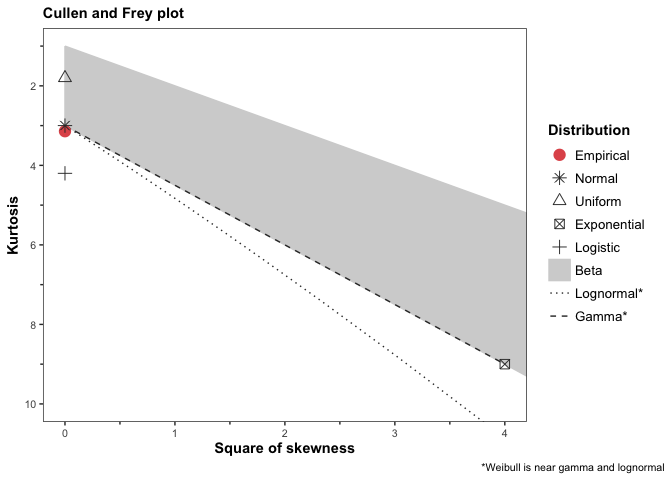
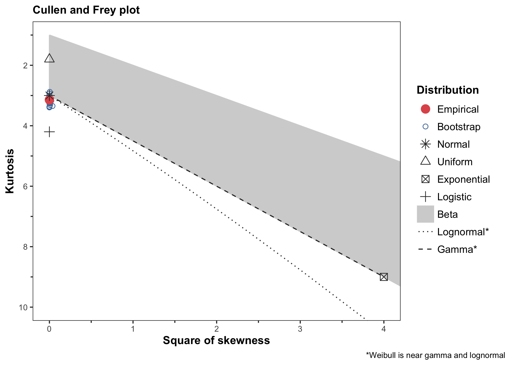
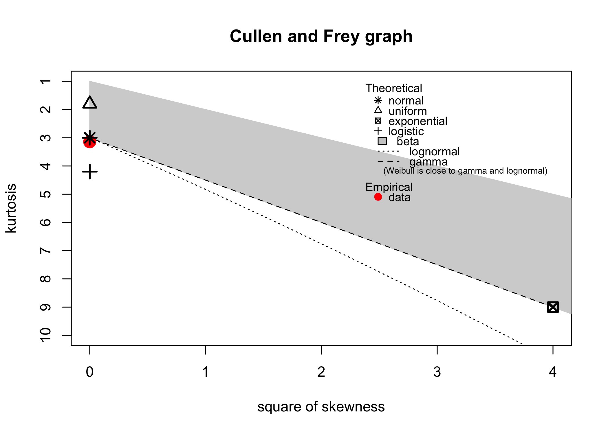

<!-- README.md is generated from README.Rmd. Please edit that file -->

# ggdescdist

<!-- badges: start -->

<!-- badges: end -->

This is a simple package with a simple goal: Produce a Cullen and Frey
skewness-kurtosis plot using `ggplot2`. The underlying code is adapted
from the `fitdistrplus` package, where the `descdist` function provides
a skewness-kurtosis plot using base R graphics. The `ggplot2` version
attempts to recreate the look and function of that plot, but with more
elegant theme elements. The beauty of `ggplot2` is that the resulting
plot is fully customizable. If desired, all theme elements can be turned
off, producing a plot using the default `ggplot2` theme.

## Installation

You can install the development version of `ggdescdist` from
[GitHub](https://github.com/) with:

``` r
# install.packages("pak")
pak::pak("mwaak/ggdescdist")
```

## Example

Note that `fitdistrplus` is not a dependency for this package. If you
wish to compare this plot to the original, then `fitdistrplus` must be
installed separately.

First, create a simple normal distribution.

``` r
library(ggdescdist)

set.seed(42)
x <- rnorm(1000, mean = 27, sd = 3)
```

Default skewness-kurtosis plot without bootstrapping:

``` r
ggdescdist(x)
```



    #> $min
    #> [1] 16.88478
    #> 
    #> $max
    #> [1] 37.48591
    #> 
    #> $median
    #> [1] 26.9606
    #> 
    #> $mean
    #> [1] 26.92253
    #> 
    #> $sd
    #> [1] 3.007564
    #> 
    #> $skewness
    #> [1] -0.00377292
    #> 
    #> $kurtosis
    #> [1] 3.141525
    #> 
    #> $method
    #> [1] "unbiased"
    #> 
    #> attr(,"class")
    #> [1] "descdist"

Skewness-kurtosis plot with bootstrapping:

``` r
ggdescdist(x, boot = 20)
```



    #> $min
    #> [1] 16.88478
    #> 
    #> $max
    #> [1] 37.48591
    #> 
    #> $median
    #> [1] 26.9606
    #> 
    #> $mean
    #> [1] 26.92253
    #> 
    #> $sd
    #> [1] 3.007564
    #> 
    #> $skewness
    #> [1] -0.00377292
    #> 
    #> $kurtosis
    #> [1] 3.141525
    #> 
    #> $method
    #> [1] "unbiased"
    #> 
    #> attr(,"class")
    #> [1] "descdist"

Compare to the original skewness-kurtosis plot (“fitdistrplus” must be
installed):

``` r
if ("fitdistrplus" %in% installed.packages()){
  fitdistrplus::descdist(x)
}
```



    #> summary statistics
    #> ------
    #> min:  16.88478   max:  37.48591 
    #> median:  26.9606 
    #> mean:  26.92253 
    #> estimated sd:  3.007564 
    #> estimated skewness:  -0.00377292 
    #> estimated kurtosis:  3.141525
